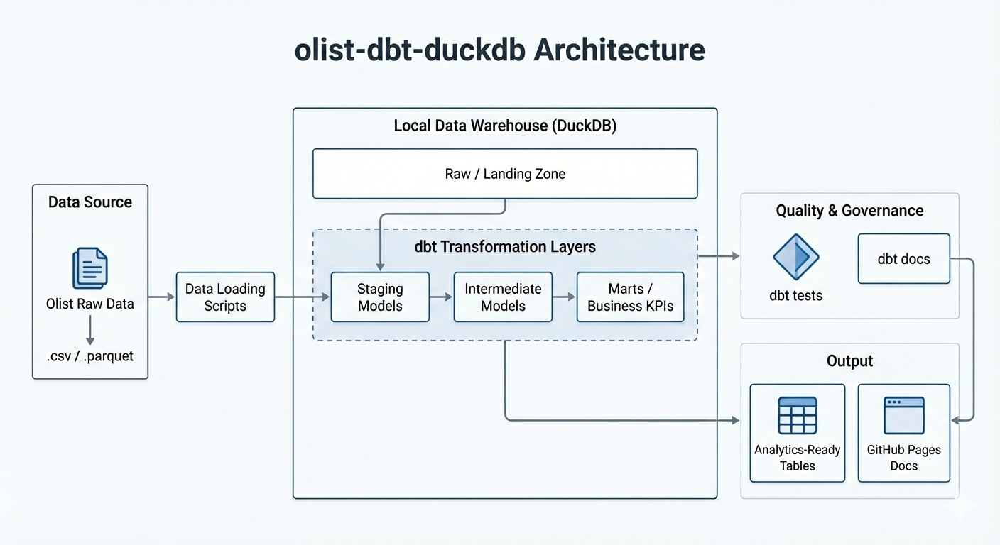

# 📊 Olist Analytics Engineering Project (SQL / dbt / DuckDB)

> 📘 **Live dbt Documentation (Lineage, Models, Tests)**  
> 👉 https://simonnc.github.io/olist-dbt-duckdb

---

## 📌 Project Overview
This project demonstrates a **production-style analytics engineering workflow** using **SQL only**, powered by **dbt + DuckDB**, on the Olist Brazilian e-commerce dataset.

The goal is to:
- model clean, testable analytics tables
- build business-ready **facts, dimensions, and KPIs**
- enforce data quality with dbt tests
- publish **auto-generated documentation** via GitHub Pages

This repository is intentionally **SQL-centric**, focusing on analytics engineering and data modeling best practices rather than notebooks or exploratory analysis.

---

## 🧱 Tech Stack
- **SQL**
- **dbt**
- **DuckDB**
- **GitHub Actions (CI)**
- **dbt Docs deployed on GitHub Pages**

---

## 🗺️ Architecture



### Architecture Overview
This project follows a **layered analytics engineering architecture**, fully implemented in **SQL with dbt**, and executed on **DuckDB** as a local analytical warehouse.

#### 1️⃣ Data Sources & Ingestion
- **Olist raw e-commerce dataset** (CSV / Parquet)
- Lightweight **Python / SQL loading scripts** ingest raw files into DuckDB
- Raw data is stored in a **Raw / Landing Zone**, without transformations

> In CI, a reduced `data_sample/` is loaded to ensure fast and reproducible builds.

#### 2️⃣ dbt Transformation Layers
All transformations are handled by **dbt models (SQL-only)** and structured into clear layers:

- **staging/**
  - Type casting, renaming, basic cleaning
  - One-to-one mapping with raw tables

- **intermediate/**
  - Business logic and grain normalization
  - Aggregations at order level (items, payments, customers)

- **marts/**
  - **core/**: canonical analytics models  
    - `fct_orders` (1 row per order)
    - customer dimensions and bridge tables
  - **kpis/**: BI-ready KPI tables (`mrt_kpi_*`)

#### 3️⃣ Data Quality & Governance
- dbt tests used as **data contracts**
- `not_null`, `unique`, `relationships`, `accepted_values`
- Tests executed locally and in **CI (GitHub Actions)**

- **dbt docs generated and deployed automatically**  
  👉 https://simonnc.github.io/olist-dbt-duckdb

#### 4️⃣ Outputs
- **Analytics-ready tables** consumable by BI tools
- **dbt documentation on GitHub Pages** (lineage, models, tests)

---

## 📦 Core Data Models

### Fact Table
**`fct_orders`**  
Grain: **1 row = 1 order**

Contains:
- order lifecycle timestamps
- order status
- item GMV & freight
- payment metrics

Acts as the **single source of truth** for downstream analytics.

---

### Dimensions
**`dim_customers`**  
Grain: `customer_id` (technical identifier)

**`dim_customer_ids`**  
Bridge table mapping:
- `customer_id` → `customer_unique_id`

**`dim_customers_unique`**  
Grain: **real customer (`customer_unique_id`)**

Enables:
- repeat customer analysis
- retention KPIs
- customer lifetime revenue

---

## 📊 KPI Marts
All KPI marts are built exclusively from core models.

### Daily KPIs
- **`mrt_kpi_daily_orders`**
- **`mrt_kpi_daily_status`**
- **`mrt_kpi_revenue_by_state_daily`**
- **`mrt_kpi_daily_customers`**

These tables are **BI-ready** and can be consumed directly by Power BI, Looker, or SQL dashboards.

---

## 🚀 How to Run Locally

```bash
python -m venv .venv
source .venv/Scripts/activate   # Windows (Git Bash)
pip install -r requirements.txt
dbt build
dbt docs generate
dbt docs serve
```

---

## 🎯 Key Learnings
- Analytics modeling with clear grains
- Handling technical vs business identifiers
- Designing bridge tables
- Building SQL-only KPI layers
- Applying dbt tests as data contracts
- Shipping analytics code like production software


---

## 🔮 Possible Improvements

This project is intentionally focused on **analytics engineering and SQL data modeling**.  
Several extensions could be added to make the project more visual and business-facing, without changing the core architecture:

- 📊 **Power BI dashboards** built directly on dbt marts (`mrt_kpi_*`) as the single source of truth  
  - Executive overview (orders, revenue, trends)  
  - Customer acquisition & retention (new vs repeat customers)  
  - Revenue by geography (state-level analysis)  
  - Order lifecycle & status distribution  

- 📈 **Advanced analytics**
  - Monthly and cohort-based retention analysis  
  - Customer lifetime value (CLV) metrics  
  - Seasonality and trend decomposition  

- 🚚 **Operational insights**
  - Delivery and logistics performance  
  - Cancellation and unavailable order analysis  

- 🔄 **Production hardening**
  - Incremental dbt models for scalability  
  - Snapshotting for slowly changing dimensions  
  - Partitioning strategies for large datasets  

All these improvements would rely exclusively on existing **dbt marts as the single source of truth**, keeping BI and analytics layers clean and consistent.


---

## 👤 About the Analyst

**Simon Jorite**  
Data Analyst | Analytics Engineer  
Microsoft Power BI Certified (PL-300)

Data Analyst with a strong background in **operations, logistics, finance, and e-commerce**, specialized in transforming complex datasets into **reliable KPIs and decision-oriented dashboards**.

Experienced across the full analytics lifecycle:
- Data preparation & quality (Python, SQL)
- Analytical modeling (star schema, BI-ready datasets)
- Business KPI design and storytelling in Power BI

This project reflects a **production-oriented analytics approach**, aligned with real business constraints and stakeholder expectations.

📍 Location: Lyon - France (Open to Hybrid / Remote projects)  
🔗 GitHub: https://github.com/SimonNC  
🔗 LinkedIn: https://www.linkedin.com/in/simonjorite  
📧 Contact: simon.jorite@gmail.com
