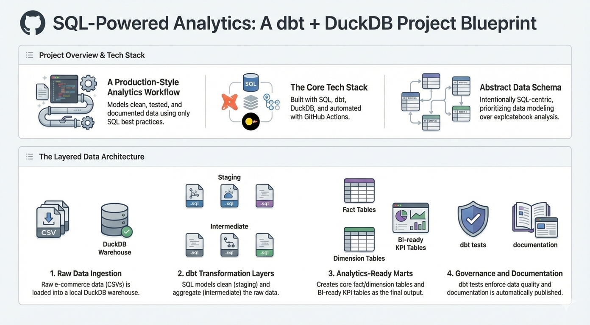
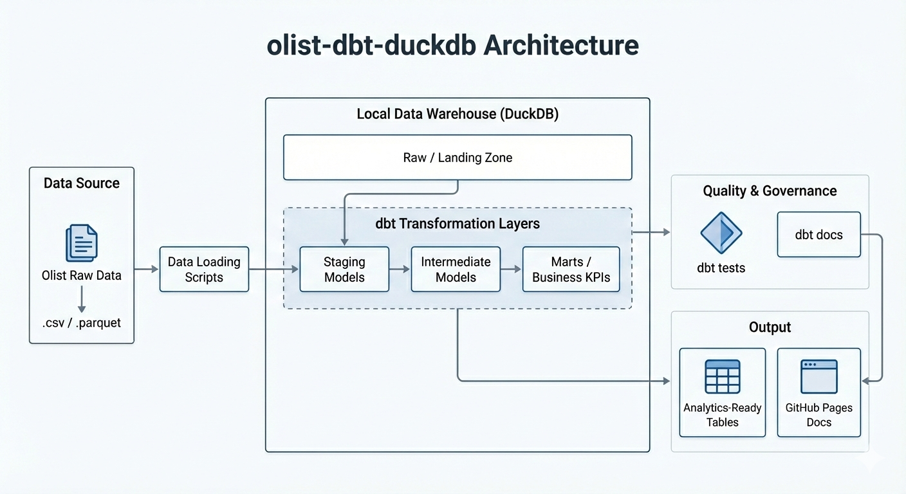

# 📊 Olist Analytics Engineering - SQL / dbt Pipeline

[](screenshots/infography.png)

> 📘 **Live dbt Documentation (Lineage, Models, Tests)**
> 👉 https://simonnc.github.io/olist-dbt-duckdb

---

## 📌 Project Overview

This project demonstrates a **production-style analytics engineering pipeline** using **SQL and dbt** on the Olist Brazilian e-commerce dataset. It delivers **BI-ready tables** (facts, dimensions, KPI marts) with enforced **data quality** and **automated CI/CD**.

> **12 dbt models, data contracts as tests, and auto-generated documentation deployed via GitHub Pages.**

The goal is to build a reliable **Single Source of Truth** for downstream dashboards and analytics, treating data as a product with version control, automated testing, and documentation at every layer.

Built with DuckDB for local development; architecture designed to port to cloud warehouses (BigQuery, Snowflake).

---

## 🗺️ Architecture

[](screenshots/architecture_schema.png)

### Pipeline Layers

```
Raw CSV/Parquet
     │
     ▼
┌─────────────────────────────────────────────────────┐
│  STAGING        Type casting, renaming, cleaning    │
│                 1:1 mapping with raw tables          │
├─────────────────────────────────────────────────────┤
│  INTERMEDIATE   Business logic, grain normalization │
│                 Order-level aggregations             │
├─────────────────────────────────────────────────────┤
│  MARTS                                              │
│  ├── core/      fct_orders, dim_customers, bridges  │
│  └── kpis/      mrt_kpi_daily_* (BI-Ready)          │
└─────────────────────────────────────────────────────┘
     │
     ▼
  Power BI / Looker / SQL dashboards
```

**Each layer has a clear responsibility.** Staging cleans and standardizes. Intermediate applies business logic and controls grains. Marts deliver analytics-ready tables that BI tools can consume directly, without further transformation.

---

## 🛠️ Technical Stack

| Component | Tool / Approach |
|---|---|
| **Transformation** | SQL only (no Python in the pipeline) |
| **Orchestration** | dbt Core |
| **Local warehouse** | DuckDB (portable; architecture targets BigQuery / Snowflake) |
| **Data quality** | dbt tests as data contracts (`not_null`, `unique`, `relationships`, `accepted_values`) |
| **CI/CD** | GitHub Actions - tests executed at every commit |
| **Documentation** | dbt docs auto-generated and deployed to [GitHub Pages](https://simonnc.github.io/olist-dbt-duckdb) |

---

## 📦 Core Data Models

### Fact Table

**`fct_orders`** - Grain: 1 row = 1 order

The **single source of truth** for all downstream KPIs. Contains order lifecycle timestamps, order status, item GMV & freight, and payment metrics.

### Dimensions

| Model | Grain | Purpose |
|---|---|---|
| `dim_customers` | `customer_id` (technical) | Customer attributes |
| `dim_customer_ids` | Bridge table | Maps `customer_id` to `customer_unique_id` |
| `dim_customers_unique` | `customer_unique_id` (business) | Enables repeat customer analysis, retention KPIs, customer lifetime revenue |

### KPI Marts (BI-Ready)

| Mart | Business Use |
|---|---|
| `mrt_kpi_daily_orders` | Daily order volume and trends |
| `mrt_kpi_daily_status` | Order status distribution over time |
| `mrt_kpi_revenue_by_state_daily` | Revenue by geography |
| `mrt_kpi_daily_customers` | New vs. returning customers |

All KPI marts are built exclusively from core models. They are **BI-ready** and can be consumed directly by Power BI, Looker Studio, or any SQL-compatible dashboard tool.

---

## 🔐 Data Quality & Governance

Data quality is not an afterthought - it is enforced at every layer through **dbt tests used as data contracts**.

| Quality Check | Implementation |
|---|---|
| Primary key uniqueness | `unique` tests on all key columns |
| Mandatory fields | `not_null` tests |
| Referential integrity | `relationships` tests across models |
| Business rules | `accepted_values` for status fields |
| Continuous integration | GitHub Actions runs all tests at every commit |
| Documentation | Auto-generated dbt docs with full lineage |

> 👉 [Browse the live documentation and lineage](https://simonnc.github.io/olist-dbt-duckdb)

---

## 💡 Key Learnings

| Topic | What I practiced |
|---|---|
| **Data modeling** | Designing facts, dimensions, and bridges with controlled grains |
| **Grain mastery** | Separating technical IDs from business identifiers |
| **SQL-only transformations** | No Python in the transformation layer - pure SQL logic |
| **Data contracts** | Using dbt tests to guarantee data quality as a contract |
| **CI/CD for data** | Automated testing and documentation at every commit |
| **Analytics engineering** | Treating data pipelines like production software |

---

## 🚀 How to Run Locally

```bash
python -m venv .venv
source .venv/Scripts/activate   # Windows (Git Bash)
pip install -r requirements.txt
dbt build
dbt docs generate
dbt docs serve
```

---

## 🔮 Possible Extensions

This project focuses on **analytics engineering and SQL data modeling**. Several extensions could be built on top without changing the core architecture:

- **Power BI dashboards** on dbt marts as single source of truth (orders, revenue, retention, geography)
- **Cohort-based retention analysis** and customer lifetime value (CLV)
- **Incremental models** for scalability on larger datasets
- **Snapshotting** for slowly changing dimensions

All extensions would consume existing marts, keeping the BI layer clean and consistent.

---

## 🎯 Skills Demonstrated

This project demonstrates competencies aligned with **Data Analyst** and **Analytics Engineer** market requirements:

| Competency | How it is demonstrated |
|---|---|
| **SQL** (advanced) | Entire pipeline is SQL-only, with CTEs, joins, aggregations, grain control |
| **ETL / data pipelines** | Layered architecture from raw to BI-ready marts |
| **Data quality & governance** | dbt tests as data contracts, CI/CD enforcement |
| **Data modeling** | Star-schema with facts, dimensions, bridges |
| **KPI design** | Business-ready KPI marts for orders, revenue, customers |
| **CI/CD & automation** | GitHub Actions running tests and deploying docs at every commit |
| **Documentation** | Auto-generated dbt docs with full lineage graph |

---

## 🔗 Related Project

This analytics engineering pipeline feeds into the companion BI project:
👉 [Olist E-commerce: End-to-End BI Solution](https://github.com/SimonNC/olist-data-analysis) (Python + Power BI dashboards)

---

## 👤 Author

**Simon Jorite**
Data Analyst - [Microsoft Certified Power BI Data Analyst (PL-300)](https://learn.microsoft.com/en-us/users/simonjorite-4846/credentials/b2cc3310a92a9302)

15 years of experience in finance, operations, and e-commerce. I transform complex datasets into reliable KPIs and decision-ready dashboards.

- GitHub: [github.com/SimonNC](https://github.com/SimonNC)
- LinkedIn: [linkedin.com/in/simonjorite](https://www.linkedin.com/in/simonjorite)
- Email: simon.jorite@gmail.com
- Location: Lyon, France (Open to hybrid / remote)
- Scheduling: [Book a 30-min exchange](https://calendly.com/simon-jorite/echange-da)
