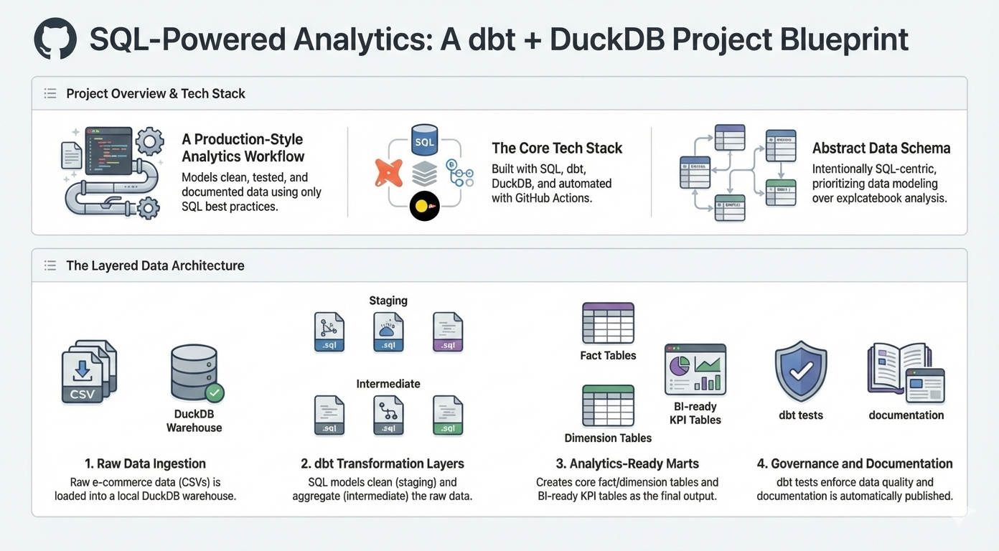
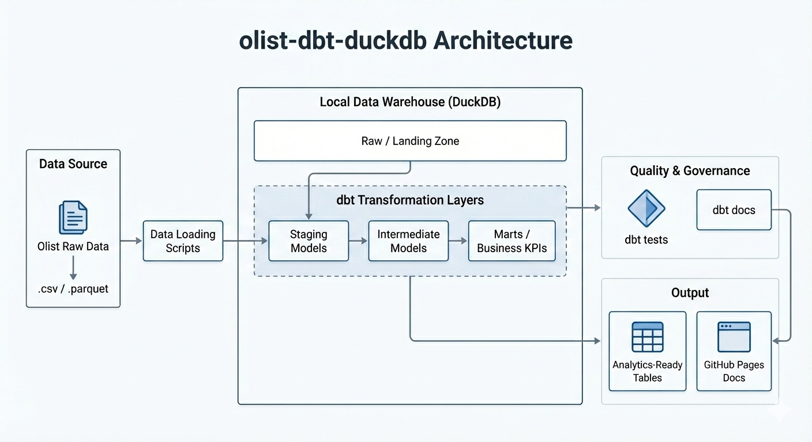

# 📊 Olist Analytics Engineering - Pipeline SQL / dbt

[🇬🇧 English version](README.en.md)

[](screenshots/infography.png)

> 📘 **Documentation dbt en ligne (Lineage, Modèles, Tests)**
> 👉 https://simonnc.github.io/olist-dbt-duckdb

---

## 📌 Vue d'ensemble du projet

Ce projet illustre un **pipeline d'analytics engineering de niveau production** utilisant **SQL et dbt** sur le jeu de données e-commerce brésilien Olist. Il produit des **tables prêtes pour la BI** (faits, dimensions, marts KPI) avec une **qualité des données** renforcée et un **CI/CD automatisé**.

> **12 modèles dbt, des data contracts sous forme de tests, et une documentation générée automatiquement et déployée via GitHub Pages.**

L'objectif est de construire une **source de vérité unique** fiable pour les tableaux de bord et analyses en aval, en traitant la donnée comme un produit avec contrôle de version, tests automatisés et documentation à chaque couche.

Construit avec DuckDB pour le développement local ; l'architecture est conçue pour être portée vers des entrepôts cloud (BigQuery, Snowflake).

---

## 🗺️ Architecture

[](screenshots/architecture_schema.png)

### Couches du pipeline

```
Raw CSV/Parquet
     │
     ▼
┌────────────────────────────────────────────────────────┐
│  STAGING        Typage, renommage, nettoyage           │
│                 mapping 1:1 avec les tables brutes     │
├────────────────────────────────────────────────────────┤
│  INTERMEDIATE   Logique métier, normalisation du grain │
│                 Agrégations au niveau commande         │
├────────────────────────────────────────────────────────┤
│  MARTS                                                 │
│  ├── core/      fct_orders, dim_customers, bridges     │
│  └── kpis/      mrt_kpi_daily_* (prêt pour la BI)      │
└────────────────────────────────────────────────────────┘
     │
     ▼
  Power BI / Looker / SQL dashboards
```

**Chaque couche a une responsabilité claire.** Staging nettoie et standardise. Intermediate applique la logique métier et contrôle les grains. Marts livrent des tables prêtes pour l'analyse, directement consommables par les outils BI, sans transformation supplémentaire.

---

## 🛠️ Stack technique

| Composant | Outil / Approche |
|---|---|
| **Transformation** | SQL uniquement (pas de Python dans le pipeline) |
| **Orchestration** | dbt Core |
| **Entrepôt local** | DuckDB (portable ; l'architecture vise BigQuery / Snowflake) |
| **Qualité des données** | Tests dbt comme data contracts (`not_null`, `unique`, `relationships`, `accepted_values`) |
| **CI/CD** | GitHub Actions - tests exécutés à chaque commit |
| **Documentation** | Documentation dbt générée automatiquement et déployée sur [GitHub Pages](https://simonnc.github.io/olist-dbt-duckdb) |

---

## 📦 Modèles de données principaux

### Table de faits

**`fct_orders`** - Grain : 1 ligne = 1 commande

La **source de vérité unique** pour tous les KPI en aval. Contient les horodatages du cycle de vie de la commande, le statut de la commande, le GMV & le fret par article, et les métriques de paiement.

### Dimensions

| Modèle | Grain | Rôle |
|---|---|---|
| `dim_customers` | `customer_id` (technique) | Attributs client |
| `dim_customer_ids` | Table de correspondance | Fait le lien entre `customer_id` et `customer_unique_id` |
| `dim_customers_unique` | `customer_unique_id` (métier) | Permet l'analyse des clients récurrents, les KPI de rétention, le revenu vie client |

### Marts KPI (prêts pour la BI)

| Mart | Usage métier |
|---|---|
| `mrt_kpi_daily_orders` | Volume et tendances de commandes quotidiennes |
| `mrt_kpi_daily_status` | Répartition des statuts de commande dans le temps |
| `mrt_kpi_revenue_by_state_daily` | Revenu par zone géographique |
| `mrt_kpi_daily_customers` | Nouveaux clients vs. clients récurrents |

Tous les marts KPI sont construits exclusivement à partir des modèles core. Ils sont **prêts pour la BI** et peuvent être consommés directement par Power BI, Looker Studio, ou tout outil de tableau de bord compatible SQL.

---

## 🔐 Qualité des données & gouvernance

La qualité des données n'est pas une réflexion après coup - elle est imposée à chaque couche grâce aux **tests dbt utilisés comme data contracts**.

| Contrôle qualité | Mise en œuvre |
|---|---|
| Unicité des clés primaires | Tests `unique` sur toutes les colonnes clés |
| Champs obligatoires | Tests `not_null` |
| Intégrité référentielle | Tests `relationships` entre les modèles |
| Règles métier | `accepted_values` pour les champs de statut |
| Intégration continue | GitHub Actions exécute tous les tests à chaque commit |
| Documentation | Documentation dbt générée automatiquement avec lineage complet |

> 👉 [Parcourir la documentation et le lineage en ligne](https://simonnc.github.io/olist-dbt-duckdb)

---

## 💡 Enseignements clés

| Sujet | Ce que j'ai pratiqué |
|---|---|
| **Modélisation des données** | Conception de faits, dimensions et tables de correspondance avec des grains maîtrisés |
| **Maîtrise du grain** | Séparation des identifiants techniques et des identifiants métier |
| **Transformations SQL uniquement** | Pas de Python dans la couche de transformation - logique purement SQL |
| **Data contracts** | Utilisation des tests dbt pour garantir la qualité des données sous forme de contrat |
| **CI/CD pour la donnée** | Tests et documentation automatisés à chaque commit |
| **Analytics engineering** | Traiter les pipelines de données comme du logiciel de production |

---

## 🚀 Exécution en local

```bash
python -m venv .venv
source .venv/Scripts/activate   # Windows (Git Bash)
pip install -r requirements.txt
dbt build
dbt docs generate
dbt docs serve
```

---

## 🔮 Extensions possibles

Ce projet se concentre sur **l'analytics engineering et la modélisation de données SQL**. Plusieurs extensions pourraient être construites par-dessus sans changer l'architecture centrale :

- **Tableaux de bord Power BI** sur les marts dbt comme source de vérité unique (commandes, revenu, rétention, géographie)
- **Analyse de rétention par cohortes** et valeur vie client (CLV)
- **Modèles incrémentaux** pour la scalabilité sur des jeux de données plus volumineux
- **Snapshotting** pour les dimensions à évolution lente

Toutes les extensions consommeraient les marts existants, en gardant la couche BI propre et cohérente.

---

## 🎯 Compétences démontrées

Ce projet démontre des compétences alignées avec les exigences du marché pour les postes de **Data Analyst** et d'**Analytics Engineer** :

| Compétence | Comment elle est démontrée |
|---|---|
| **SQL** (avancé) | Pipeline entièrement en SQL, avec CTE, jointures, agrégations, contrôle du grain |
| **ETL / pipelines de données** | Architecture en couches, du brut aux marts prêts pour la BI |
| **Qualité des données & gouvernance** | Tests dbt comme data contracts, application via CI/CD |
| **Modélisation des données** | Star-schema avec faits, dimensions, tables de correspondance |
| **Conception de KPI** | Marts KPI prêts pour le métier pour les commandes, le revenu, les clients |
| **CI/CD & automatisation** | GitHub Actions exécutant les tests et déployant la documentation à chaque commit |
| **Documentation** | Documentation dbt générée automatiquement avec graphe de lineage complet |

---

## 🔗 Projet lié

Ce pipeline analytics engineering alimente le projet BI compagnon :
👉 [Olist E-commerce: End-to-End BI Solution](https://github.com/SimonNC/olist-data-analysis) (Python + tableaux de bord Power BI)

---

## 👤 Auteur

**Simon Jorite**
Data Analyst - [Certifié Microsoft Power BI Data Analyst (PL-300)](https://learn.microsoft.com/en-us/users/simonjorite-4846/credentials/b2cc3310a92a9302)

15 ans d'expérience en finance, opérations et e-commerce. Je transforme des jeux de données complexes en KPI fiables et en tableaux de bord prêts pour la décision.

- GitHub : [github.com/SimonNC](https://github.com/SimonNC)
- LinkedIn : [linkedin.com/in/simonjorite](https://www.linkedin.com/in/simonjorite)
- Email : simon.jorite@gmail.com
- Localisation : Lyon, France (Ouvert à un poste hybride ou en télétravail)
- Prise de RDV : [Réserver un échange de 30 min](https://calendly.com/simon-jorite/echange-da)
